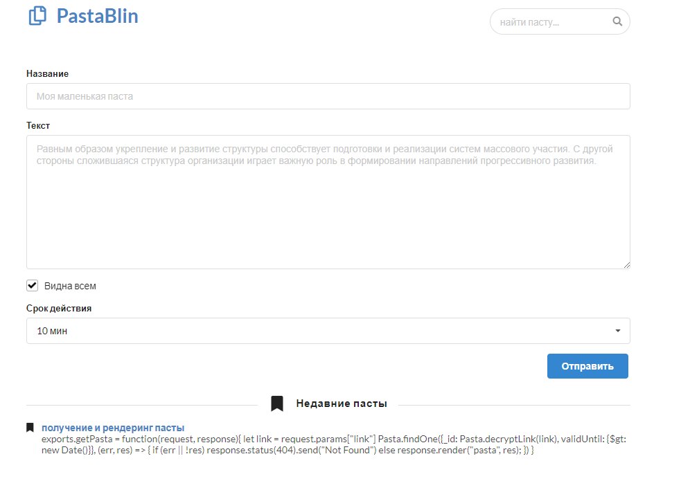

# PastaBlin

Наивный аналог сервиса [pastebin](https://pastebin.com/). Выполнен в качестве тестового задания. 
- Паттерн MVC на фреймворке [Express](https://www.npmjs.com/package/express)
- движок рендеринга [Handlebars](https://handlebarsjs.com/)
- ODM либа для базы данных - [Mogoose](https://mongoosejs.com/)

[Try It Now](http://45.135.164.202:3000/)\
Сервер уже развернут на очень слабенькой машинке (1x2.2Ггц, 512Мб, Ubuntu 16.04 LTS), поэтому приложение может притормаживать.

## Установка
Для начала потребуется развернуть локально базу данных [MongoDB](https://www.mongodb.com/download-center/charts) и создать в ней коллекцию "pastas", а так же не забыть повесить текстовый индекс на поля "title" и "text", иначе не заработает полнотекстовый поиск.
```
db.getCollection('pastas').createIndex( { title: "text", text: "text" } )
```

Приложение написано полностью на [Node.js](https://nodejs.org/en/download/).

Установим все необходимые зависимости с помощью Node Package Manager (поставляется вместе с дистрибутивом Node.js) и запустим сервер на 3000 порту
```
npm install
node ./index.js
```

